# ESP32-S3 WiFi Clock

This repository contains the firmware for a feature-rich, Wi-Fi connected smart clock powered by an ESP32-S3 microcontroller. It features a large 4" color IPS display, a web-based interface for easy configuration, automatic time synchronization, environmental sensing, and detailed weather forecasts.

## Table of Contents

- [Features](#features)
- [Hardware Requirements](#hardware-requirements)
- [Assembly](#assembly)
- [Wiring](#wiring)
- [Software Setup](#software-setup)
- [Software Architecture](#software-architecture)
- [Usage Guide](#usage-guide)
  - [First-Time Setup](#first-time-setup)
  - [Web Interface](#web-interface)
  - [Physical Button Functions](#physical-button-functions)
  - [Factory Reset](#factory-reset)
- [Features and Settings in Detail](#features-and-settings-in-detail)
- [Project Roadmap](#project-roadmap)

## Features

- **Large Color Display**: A 4" 480x320 color IPS display provides a clear and vibrant user interface.
- **Weather Forecast**: Accurate local weather data powered by Open-Meteo, including temperature, humidity, wind speed, rain chance, and current conditions.
- **Web-Based Configuration**: A mobile-friendly web UI allows for easy setup and configuration without needing to re-flash the firmware.
- **Dynamic Alarms**: Configure up to 20 alarms. Add, delete, and modify alarms directly from the web interface.
- **Customizable UI**: Change display colors, flip the screen orientation, and toggle between 12/24-hour format and Celsius/Fahrenheit.
- **Page Management**: Enable, disable, and reorder display pages (Clock, Weather, Weather+Clock, Info) to suit your preference.
- **WiFi & AP Mode**: Connects to your local WiFi network or starts its own Access Point (`Clock-Setup`) if credentials are not set.
- **Automatic Time Sync**: An onboard Real-Time Clock (DS3231) with battery backup keeps accurate time, synchronized daily with NTP internet servers.
- **Timezone Support**: Select your local timezone from a dropdown list.
- **Temperature Sensors**: A BME280 sensor for ambient temperature and humidity, and a sensor within the DS3231 for time-drift compensation.
- **Smart Brightness Control**: The display backlight can be controlled manually via the web UI or set to an automatic day/night schedule.
- **System Logging**: Integrated logging system with file rotation (`system.log`) and a live WebSocket-based log viewer in the web UI.
- **Over-the-Air (OTA) Updates**: Update the clock's firmware directly from the web interface.
- **Persistent Storage**: All settings (WiFi credentials, display preferences, alarms) are saved to the ESP32's internal flash storage.
- **mDNS Support**: Access the clock's web interface using a human-readable name (e.g., `ESP32Clock-XXXXXX.local`).
- **Physical Factory Reset**: Hardware-based methods to reset the device to its default settings.

---

## Hardware Requirements

| Component           | Description                                                          |
| ------------------- | -------------------------------------------------------------------- |
| **Microcontroller** | **ESP32-S3-WROOM-1 N16R8** Development Board (16MB Flash, 8MB PSRAM) |
| **Display**         | **4" ILI9488 IPS LCD** Display Module (480x320) with SPI interface   |
| **Real-Time Clock** | **DS3231** RTC Module with a LIR2032 battery for backup              |
| **Sensor**          | **BME280** Temperature, Humidity, and Pressure Sensor Module (I2C)   |
| **Power Supply**    | A reliable 5V USB-C power supply                                     |

## Case 3D Model

[Download](./case%20model/ESP32%20Clock%20Case%204%20inch%20v18.step)

## Parts List

Here is a list of all the components required to build the ESP32-S3 WiFi Clock, along with purchase links:

| Component                                                           | Description                          | Link                                                 |
| ------------------------------------------------------------------- | ------------------------------------ | ---------------------------------------------------- |
| **ESP32-S3-WROOM-1 Development Board**                              | 16MB Flash, 8MB PSRAM                | [AliExpress Link](https://a.aliexpress.com/_mMm2jWD) |
| **4" ILI9488 IPS LCD Display**                                      | 480×320 SPI interface                | [AliExpress Link](https://a.aliexpress.com/_mt2vtEh) |
| **DS3231 RTC Module**                                               | With LIR2032 battery backup          | [AliExpress Link](https://a.aliexpress.com/_mPeDmLR) |
| **BME280 Sensor Module**                                            | Temperature, Humidity, Pressure, I2C | [AliExpress Link](https://a.aliexpress.com/_mtACD9f) |
| **Active Buzzer**                                                   | Any small 5V buzzer                  | [AliExpress Link](https://a.aliexpress.com/_mKjibtR) |
| **6x6x7.2mm Micro Switch**                                          | For Snooze/Stop functionality        | can source locally                                   |
| **USB-C Inlet**                                                     | For powering the clock               | [AliExpress Link](https://a.aliexpress.com/_msBRQoD) |
| **5V USB-C Power Supply**                                           | Reliable 5V power source             | can source locally                                   |
| **Male Machine Pin Headers**                                        | For connecting modules to boards     | [AliExpress Link](https://a.aliexpress.com/_mPmIdmp) |
| **DuPont Wires (Male-to-Male / Female-to-Male / Female-to-Female)** | For connections between headers      | [AliExpress Link](https://a.aliexpress.com/_mLxGsFP) |
| **DuPont Wire Kit (Headers + Housing)**                             | 310 pcs set for custom connections   | [AliExpress Link](https://a.aliexpress.com/_msXyJap) |
| **Prototype Boards / Perfboards**                                   | For mounting modules                 | can source locally                                   |
| **Heat-Set Inserts**                                                | For case assembly                    | can source locally                                   |
| **Screws (M2)**                                                     | For case and module mounting         | [AliExpress Link](https://a.aliexpress.com/_mtl7Jwt) |

## Assembly

Follow these steps to assemble the ESP32-S3 WiFi Clock:

1. **Flash Firmware**  
   Flash the initial firmware to the ESP32-S3 before starting physical assembly.

2. **Prepare Headers**

   - Replace the existing headers on the display and RTC modules with male machine pin headers.
   - Solder a male dupont header onto the BME280 sensor.

3. **Connect Display**

   - Solder the display header to the prototype board.
   - Route the wires carefully to the opposite side for easy access.  
     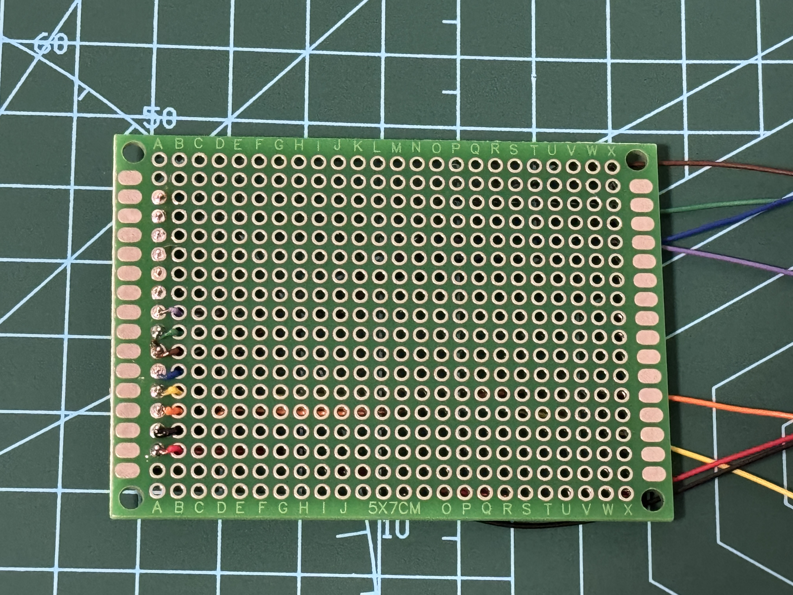 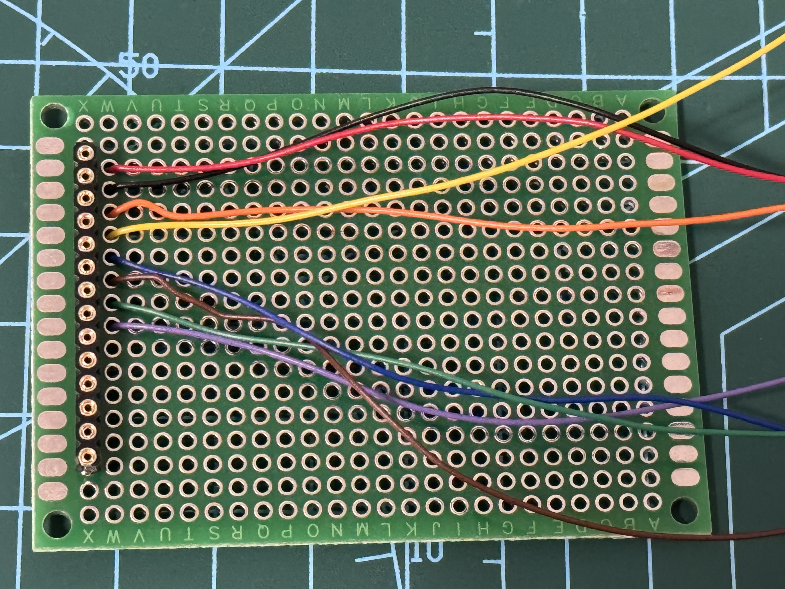

4. **Solder Remaining Headers**

   - Connect all other headers and wires.
   - Keep wires slightly longer in case adjustments are needed.  
     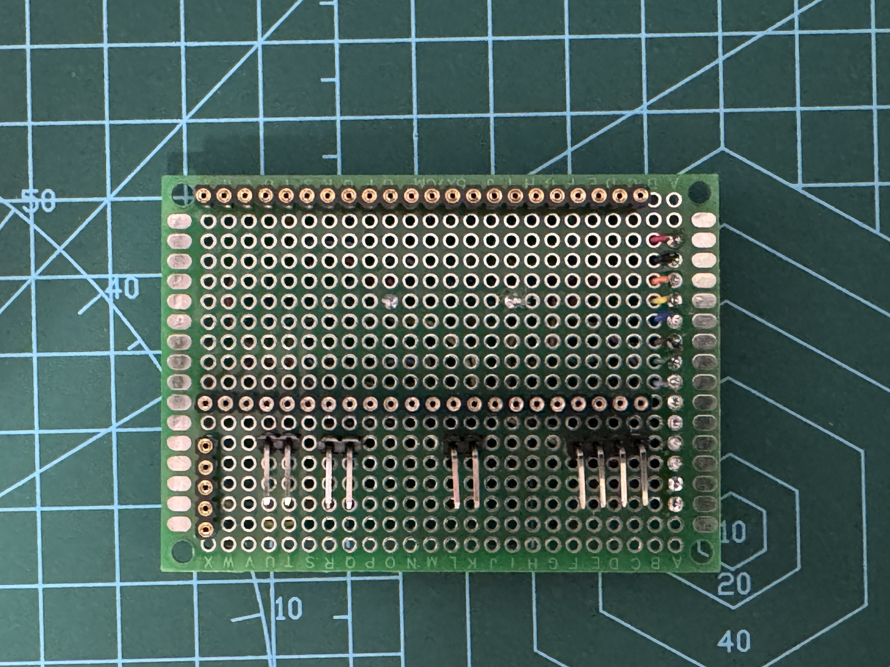 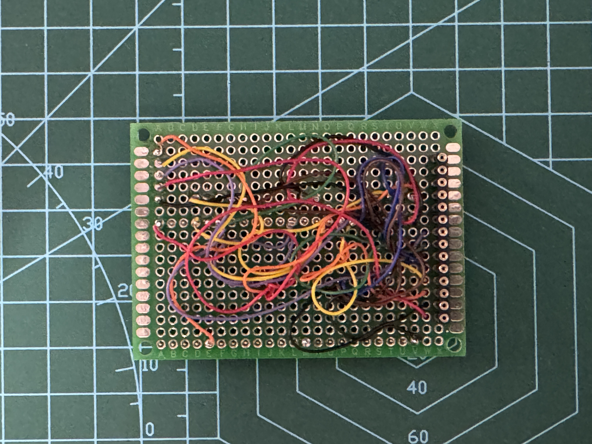

5. **Fit Components**

   - Ensure the modules fit inside the case.
   - Sand the sides of the RTC if space is tight.  
     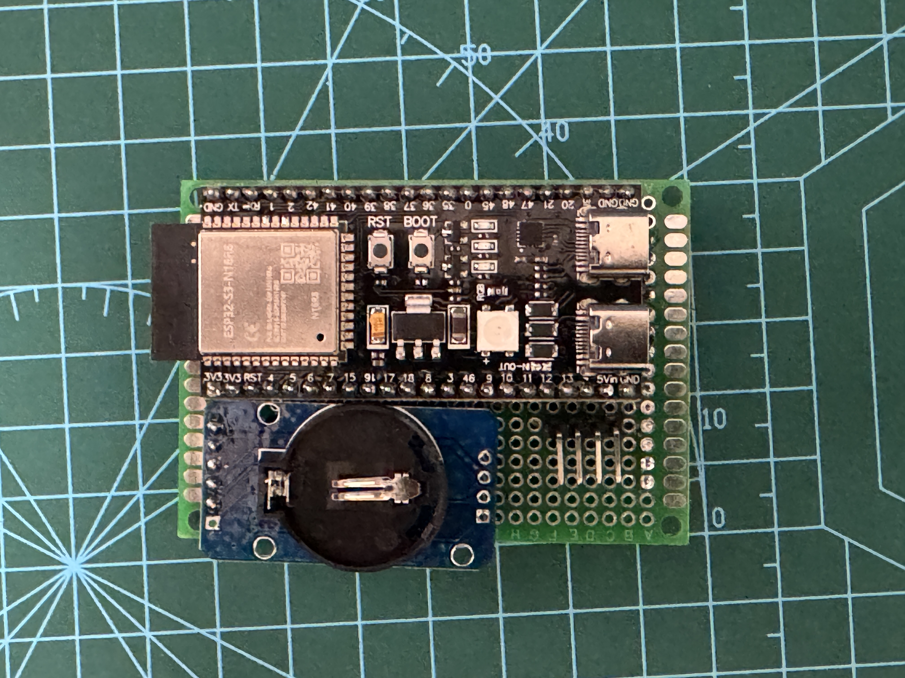

6. **Install Heat-Set Inserts**

   - Insert into the back panel of the case for M2 screws (sizes: 3×3.2mm and 2×4mm).  
     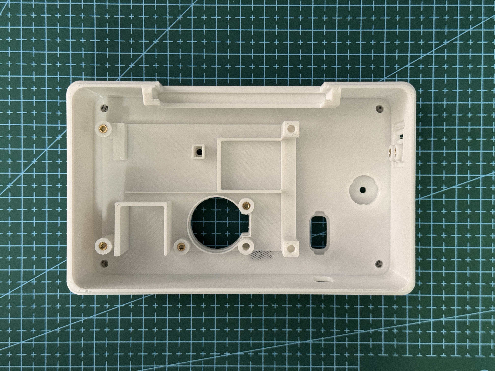 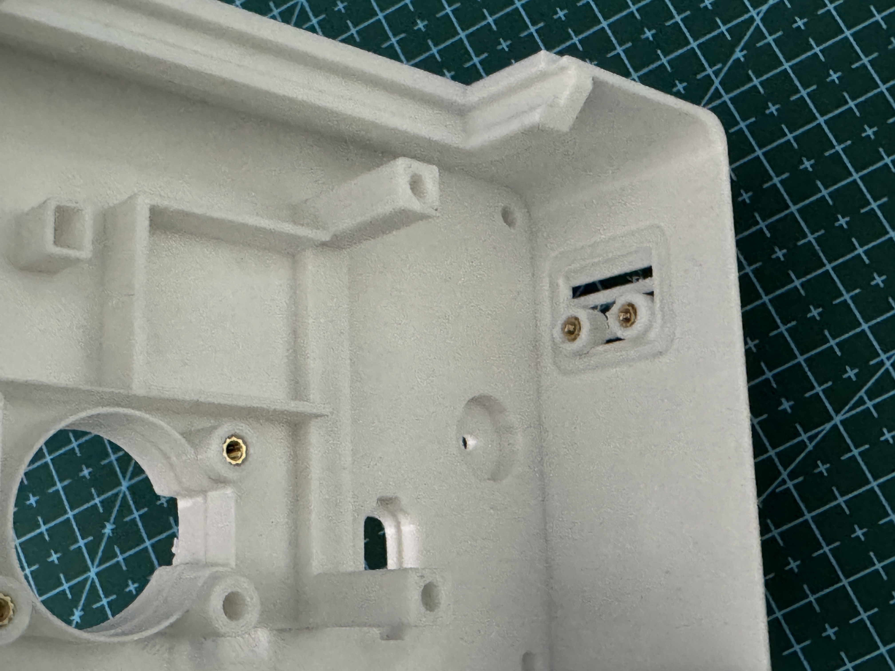 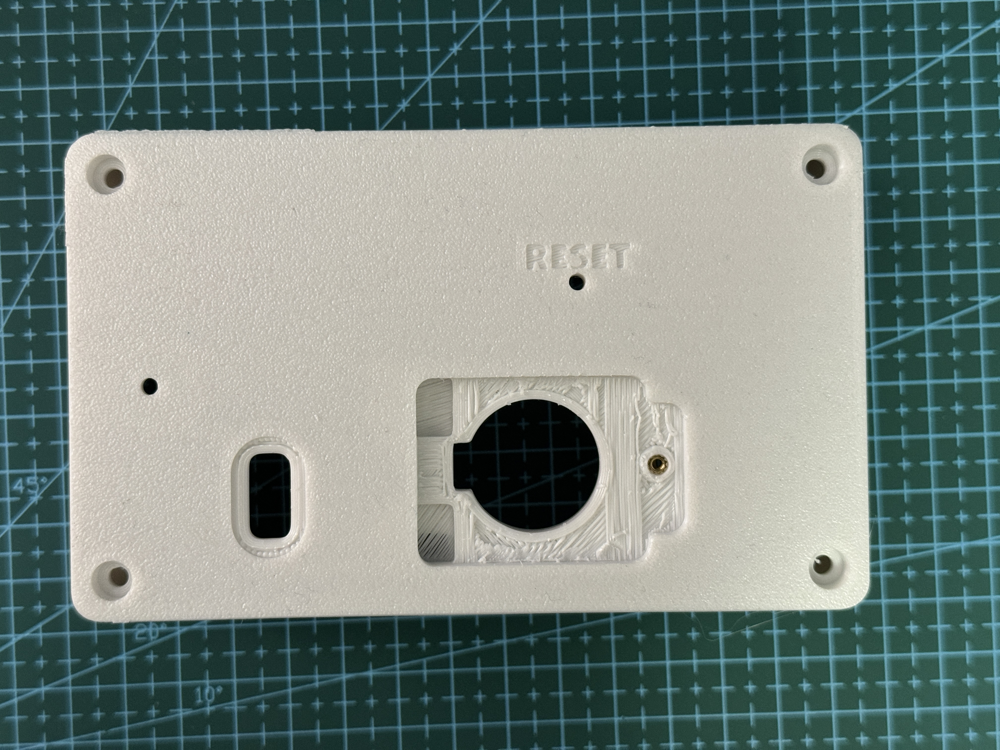

7. **Install Front Panel Inserts**

   - Install inserts for the display (M2) and posts (M3).

8. **Assemble Components**

   - Plug in all connectors.
   - Secure the display, RTC, and sensors with the appropriate screws.  
     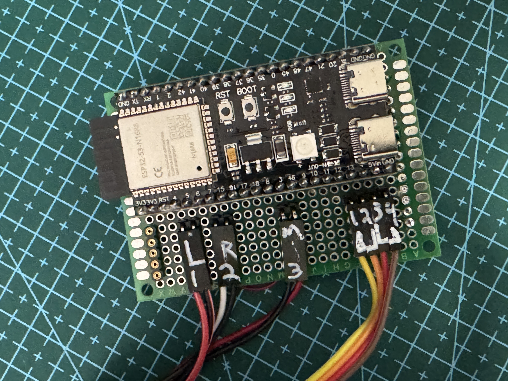 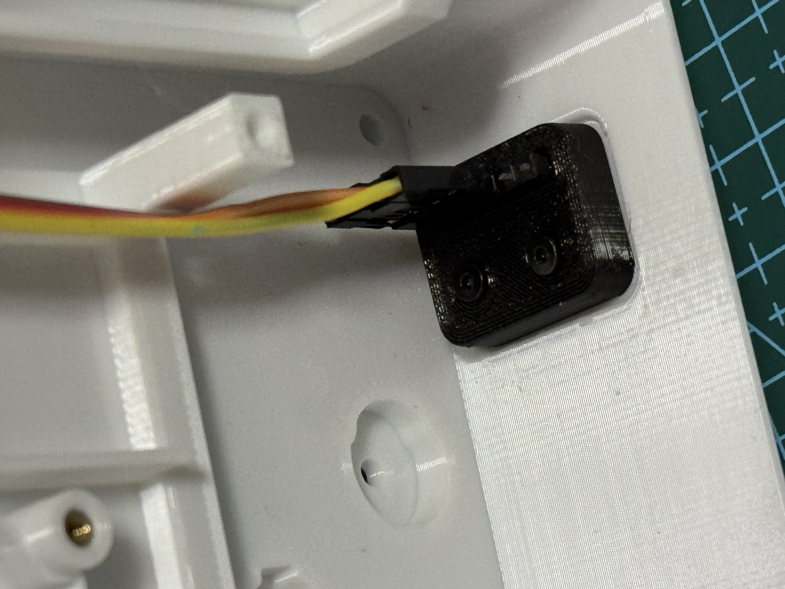 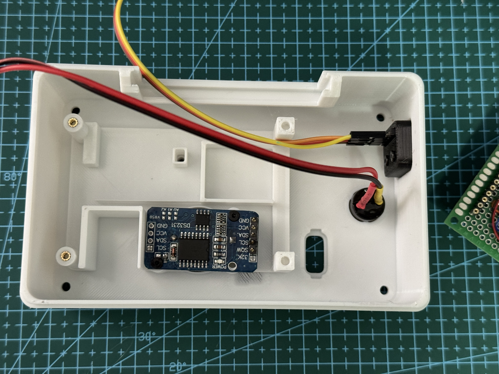 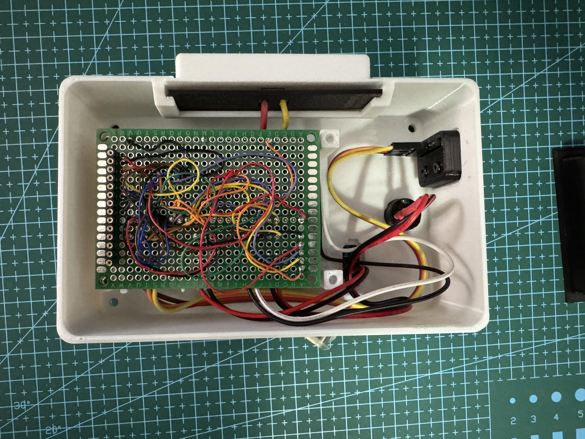

9. **Close Case and Power On**
   - Screw the case together and connect power.  
     

## Wiring

The components are connected using the I2C and SPI buses.

| Component                 | Pin       | ESP32-S3 GPIO | Notes                 |
| ------------------------- | --------- | ------------- | --------------------- |
| **4" ILI9488 IPS (SPI)**  | VCC       | 3.3V          | Connect to 3.3V pin   |
|                           | GND       | GND           | Common ground         |
|                           | CS        | GPIO 10       | Chip Select           |
|                           | RST       | GPIO 11       | Reset                 |
|                           | DC        | GPIO 12       | Data/Command          |
|                           | MOSI      | GPIO 13       | Data In               |
|                           | SCK       | GPIO 14       | Clock                 |
|                           | LED       | GPIO 6        | Backlight (PWM)       |
|                           | MISO      | UNUSED        | Data Out              |
| **DS3231 & BME280 (I2C)** | VCC       | 3.3V          | Shared 3.3V           |
|                           | GND       | GND           | Shared ground         |
|                           | SDA       | GPIO 8        | Shared data line      |
|                           | SCL       | GPIO 9        | Shared clock line     |
| DS3231                    | SQW       | GPIO 2        | Interrupt for alarms  |
| **Active Buzzer**         | +         | GPIO 4        | Any free GPIO         |
|                           | -         | GND           | Common ground         |
| **Stop/Snooze Button**    | One leg   | GPIO 5        | Use INPUT_PULLUP mode |
|                           | Other leg | GND           | Common ground         |

## Software Setup

This project is developed using **PlatformIO**.

### Libraries

The following libraries are required and are automatically managed by PlatformIO via the `platformio.ini` file:

- `bodmer/TFT_eSPI`
- `bblanchon/ArduinoJson`
- `adafruit/RTClib`
- `adafruit/Adafruit BME280 Library`
- `esphome/ESPAsyncWebServer-esphome`
- `esphome/AsyncTCP-esphom`

### Build Instructions

1.  **Clone the Repository**:
    ```bash
    git clone https://github.com/KennethDoerflein/ESP32Clock.git
    cd ESP32Clock
    ```
2.  **Open in PlatformIO**: Open the project folder in VS Code with the PlatformIO extension installed.
3.  **Build & Upload**: Use the PlatformIO "Build" and "Upload" commands to compile and flash the firmware to your ESP32-S3.

---

## Software Architecture

The firmware is organized into a collection of singleton manager classes, each responsible for a specific aspect of the clock's functionality.

- **`AlarmManager`**: Manages the physical ringing of an alarm (buzzer and display).
- **`ClockWebServer`**: Manages the ESP32's web server for configuration and updates.
- **`ConfigManager`**: Manages the application's configuration settings.
- **`DisplayManager`**: Manages the active display page, alarm overlays, and orchestrates rendering.
- **`SerialLog`**: A singleton logger that mirrors Serial output to a WebSocket and a rotating log file.
- **`TimeManager`**: Manages timekeeping, NTP synchronization, and time formatting.
- **`UpdateManager`**: Handles OTA (Over-the-Air) firmware updates.
- **`WeatherService`**: Handles fetching weather data and resolving locations via Open-Meteo.
- **`WiFiManager`**: Manages WiFi connectivity for the ESP32.
- **`Display`**: Manages the low-level TFT display and backlight.
- **`Page`**: An abstract base class for a single display page.
  - **`ClockPage`**: A page that displays the main clock face.
  - **`WeatherPage`**: A page that displays detailed weather conditions.
  - **`WeatherClockPage`**: A combined page showing both time and weather.
  - **`InfoPage`**: A simple page that displays static system information.

---

## Usage Guide

### First-Time Setup

1.  On the first boot, or if WiFi credentials are not configured/valid, the clock will start a Wi-Fi Access Point (AP). The SSID will be **`Clock-Setup`**.
2.  Connect to this network from your phone or computer.
3.  Open a web browser and navigate to the clock's static IP address, which is **`http://192.168.4.1`**. This address is fixed when the clock is in AP mode.

### Web Interface

The web interface provides access to all the clock's settings. Once connected to your WiFi network, you can access the web interface by navigating to the IP address shown on the clock's display or by using its mDNS address (e.g., `http://ESP32Clock-XXXXXX.local`).

The web interface is organized into several sections:

- **Configure WiFi**: For connecting to your local network and setting a hostname.
- **Alarms**: For setting and managing up to 20 alarms.
- **Weather**: For configuring the location and viewing weather status.
- **Settings**: For adjusting display, time, brightness, and page configuration.
- **Logs**: For viewing live logs and managing log files.
- **System**: For system-level actions like updates, reboots, and viewing system information.

### Physical Button Functions

The physical button (connected to GPIO 5) serves multiple purposes depending on the context:

- **Normal Operation**: A short press cycles through the available display pages (e.g., Clock, Weather, Weather+Clock).
- **Alarm Ringing**:
  - A **short press** will **snooze** the alarm for the duration specified in the web interface.
  - **Pressing and holding** the button will **dismiss** the alarm. The required hold time can be configured in the web interface.
- **Alarm Snoozed**:
  - **Pressing and holding** the button for 3 seconds will end the snooze and dismiss the alarm.

### Factory Reset

There are three ways to perform a factory reset:

1.  **Via the Web Interface**: Navigate to the "System" page and click the "Factory Reset" button.
2.  **Boot-Time Reset**:
    - Disconnect the clock from power.
    - Press and hold the **Snooze button** (GPIO 5).
    - Reconnect the power while still holding the button.
    - Continue holding for **30 seconds**. The screen will display a confirmation message.
3.  **Runtime Reset**:
    - While the clock is running normally, press and hold the **Boot button** (GPIO 0) on the ESP32 board for **10 seconds**.

---

## Features and Settings in Detail

### WiFi Page

This page allows you to connect the clock to your local WiFi network.

- **Scan for Networks**: Click the "Scan" button to see a list of available WiFi networks. Clicking on a network name will automatically fill in the SSID field.
- **SSID & Password**: Manually enter your network's name and password.
- **Save & Reboot**: Click to save the credentials to the device's persistent memory. The clock will then automatically reboot and connect to the configured network.
- **Hostname**: You can set a custom hostname for the device on your network. This also serves as the mDNS address (e.g., `http://your-hostname.local`).

### Alarms Page

- **Dynamic Alarms**: You can add up to 20 alarms. Click "Add Alarm" to create a new one.
- **Alarm Management**: For each alarm, you can:
  - **Enable/Disable**: Toggle the alarm on or off.
  - **Set Time**: Configure the hour and minute.
  - **Set Repeat Days**: Choose which days of the week the alarm should be active.
  - **Delete**: Remove an alarm permanently.
- **Snooze Duration**: Set the number of minutes the alarm will wait before ringing again after the snooze button is pressed.
- **Dismiss Duration**: Configure how many seconds the physical button must be held down to dismiss a ringing alarm completely.

### Weather Page

This page allows you to configure the location for weather forecasts.

- **Location Setup**: Enter your city or address in the input field (e.g., "New York, NY" or "Paris, France") and click "Save Location".
- **Auto-Resolve**: The system will automatically resolve the address to coordinates using the Open-Meteo Geocoding API.
- **Units**: Weather units (Celsius/Fahrenheit) follow the global system setting defined in the Settings page.

### Settings Page

This page is divided into two tabs: "General" and "Display".

#### General Tab

- **Page Configuration**:
  - **Default Page**: Select which page the clock should show on startup.
  - **Enabled Pages**: Drag and drop pages to reorder them or uncheck them to hide them from the rotation.
- **Brightness Settings**:
  - **Auto Brightness**: Enables a schedule-based brightness adjustment, with configurable start/end times and day/night brightness levels.
  - **Manual Brightness**: When Auto Brightness is disabled, a single slider allows you to set a fixed brightness level.
- **Time and Display Format**:
  - **24-Hour Format**: Toggles the time display between 12-hour (e.g., 3:45 PM) and 24-hour (e.g., 15:45) formats.
  - **Use Celsius (°C)**: Switches the temperature display between Celsius and Fahrenheit.
  - **Flip Display Orientation**: Rotates the display by 180 degrees.
- **Timezone**: Select your local timezone from a dropdown list.

#### Display Tab

This tab provides a set of color pickers to customize the appearance of nearly every element on the clock face.

- **Customizable Elements**: Background, Time, AM/PM, Seconds, Day of the Week, Date, Temperature, Humidity, and Weather elements.
- **Reset to Defaults**: A button is provided to revert all color settings to their original values.

### Logs Page

This page provides tools for monitoring and debugging the system.

- **Live Log**: A real-time WebSocket view of the serial log output.
- **System Log File**:
  - **Download**: Download the persistent `system.log` file.
  - **Rollover**: Manually force a log file rotation (renames current to `.old` and starts fresh).

### System Page

This page contains tools for firmware updates and system-level commands.

#### Firmware Update

- **Manual Upload**: Update the firmware by selecting a compiled `.bin` file from your computer and clicking "Upload."
- **GitHub Update**: The clock can automatically check for the latest release on this GitHub repository and perform an update if a newer version is available.

#### System Actions

- **Reboot Device**: Safely restarts the clock.
- **Factory Reset**: Erases all stored settings (including WiFi credentials, alarms, and display preferences) and reboots the device.
- **Factory Reset (Keep WiFi)**: Erases all settings _except_ for the saved WiFi credentials.

#### System Information

The System page also displays a live feed of the clock's internal statistics, which can be useful for diagnostics:

- **Free Heap**: The amount of available memory.
- **Uptime**: How long the device has been running since its last reboot.
- **WiFi RSSI**: The signal strength of the WiFi connection.
- **ESP32 Core Temperature**: The internal temperature of the main processor.

### A Note on Temperature Sensors

This project utilizes two temperature sensors:

1.  **BME280**: This is the primary sensor for ambient room temperature and humidity, and its readings are what's shown on the main display.
2.  **DS3231**: The Real-Time Clock module contains its own internal temperature sensor. This is used by the RTC to compensate for temperature variations and maintain accurate timekeeping. It is not displayed on the clock face.

---

## Project Roadmap

This project is broken down into phases to prioritize a functional base clock before implementing more complex features.

### V1.1.0 (Completed - moved to V2.0.0)

- [x] **Alarm Management**
  - [x] Add/Delete alarms (Dynamic alarms).
  - [x] Increased limit (up to 20 alarms).
- [x] **Logging**
  - [x] Create a log file that is stored in LittleFS.
  - [x] The log file should be appended to and automatically roll over.
  - [x] Live Log Viewer in Web UI.

### V2.0.0 (Completed)

- [x] **Add Weather Page**
  - [x] Get longitude and latitude from a zip code/address and store it in the filesystem.
  - [x] Use location data to get weather from Open-Meteo.
  - [x] Update weather information periodically.
  - [x] Add a "Weather" page and a combined "Weather+Clock" page.
- [x] **UI/UX Enhancements**
  - [x] Allow users to set a default display page.
  - [x] Enable/Disable and reorder pages.

---

