# ESP32-S3 WiFi Clock

This repository contains the firmware for a feature-rich, Wi-Fi connected smart clock powered by an ESP32-S3 microcontroller. It features a large 4" color IPS display, a web-based interface for easy configuration, automatic time synchronization, environmental sensing, and detailed weather forecasts.

## Table of Contents

- [Features](#features)
- [Hardware Requirements](#hardware-requirements)
- [Assembly](#assembly)
- [Wiring](#wiring)
- [Software Setup](#software-setup)
- [Software Architecture](#software-architecture)
- [Usage Guide](#usage-guide)
  - [First-Time Setup](#first-time-setup)
  - [Web Interface](#web-interface)
  - [Physical Button Functions](#physical-button-functions)
  - [Safe Mode & Boot Loop Protection](#safe-mode--boot-loop-protection)
  - [Factory Reset](#factory-reset)
- [Features and Settings in Detail](#features-and-settings-in-detail)
  - [WiFi Page](#wifi-page)
  - [Alarms Page](#alarms-page)
  - [Weather Page](#weather-page)
  - [Settings Page](#settings-page)
  - [Logs Page](#logs-page)
  - [System Page](#system-page)
  - [Temperature & Environmental Sensor Architecture](#temperature--environmental-sensor-architecture)
- [Project Roadmap](#project-roadmap)

## Features

- **Large Color Display**: A 4" 480x320 color IPS display provides a clear and vibrant user interface with smooth anti-aliased font rendering and sprite-based double buffering.
- **Rich Weather Forecasts**: Local weather powered by the Open-Meteo API, including current temperature, apparent "feels like" temperature, relative humidity, wind speed, wind direction, wind gusts, rain probability, cloud cover, UV index, atmospheric pressure, visibility, weather conditions, and daily sunrise/sunset times.
- **Asynchronous Geocoding**: Enter any city or address (e.g., "New York, NY" or "Paris, France") and coordinates are automatically resolved asynchronously via the Open-Meteo Geocoding API with state-code awareness.
- **Multi-Layer Timekeeping & Synchronization**:
  - Hardware DS3231 Real-Time Clock with battery backup ensures uninterrupted timekeeping across power outages.
  - Multi-tier NTP synchronization (primary: `time.nist.gov`, backup: `time.cloudflare.com`, fallback: `us.pool.ntp.org`) with exponential backoff and jitter.
  - Daily automatic synchronization, periodic drift detection and resyncing.
  - Initial boot seeding from RTC to guarantee accurate timestamps prior to network connection.
  - Browser-to-device one-click manual time sync via web interface for air-gapped or offline setups.
  - Automatic Daylight Saving Time (DST) detection and full POSIX timezone support.
- **Advanced Dynamic Alarms**:
  - Configure up to 20 alarms via the web interface.
  - Set custom hour and minute, individual days of the week, or one-time alarms.
  - **Biweekly Scheduling**: Configure alarms to repeat every other week (even or odd week cycles).
  - **3-Stage Progressive Ramping Buzzer**: Transitions from slow beeping (10s) to rapid beeping (20s) to continuous tone.
  - Visual alarm indicators: flashing display backlight and on-screen active alarm / snooze countdown overlay.
  - **Reboot Persistence & Auto-Shutoff**: Automatically resumes ringing if a power cycle occurs while active, and automatically silences after 30 minutes.
  - **Missed Alarm Catch-Up**: Detects and triggers alarms that were missed during unexpected power outages or clock adjustments (capped at 90 minutes).
  - Customizable snooze duration and hold-to-dismiss timer.
- **Environmental Sensing & Thermal Compensation**:
  - BME280 sensor reads ambient room temperature, relative humidity, and pressure with fallback to DS3231 internal sensor.
  - Exponential moving average (EMA) noise filtering.
  - Cold-boot automatic temperature calibration.
  - Configurable enclosure heat compensation factor and manual offset correction.
  - Relative humidity compensation based on the August-Roche-Magnus approximation.
- **Multi-Page Display Management**:
  - 4 built-in display pages: **Clock**, **Weather**, **Weather+Clock** (combined), and **Info**.
  - Enable, disable, and custom-order pages via Move Up / Move Down buttons in the web interface.
  - Configurable startup/default page.
  - Physical button single-press page cycling with display preemption on Core 1 for stutter-free rendering.
- **Customizable Appearance**:
  - Full hex color picker support for individual UI elements: Background, Time, AM/PM, Seconds, Day of Week, Date, Temperature, Humidity, Alarm/Snooze icons, Weather Temp, and Forecast conditions.
  - Screen flip (180° rotation) and color inversion toggles.
  - 12-hour (with AM/PM) or 24-hour format; Fahrenheit or Celsius temperature units.
- **Smart Backlight Control**:
  - Scheduled Auto Brightness with custom day/night transition hours and brightness levels.
  - Manual brightness slider (0–255 PWM).
- **Offline Mode**: Complete disconnected operation with WiFi and online polling turned off.
- **WiFi Connectivity & Captive Portal**:
  - Connects to 2.4 GHz 802.11 b/g/n networks.
  - Automatic Access Point (`Clock-Setup`) and Captive Portal with OS connectivity detection if unconfigured or connection fails.
  - In-browser network scanning and non-blocking credential testing.
  - Custom hostname and mDNS address (e.g., `http://ESP32Clock-XXXXXX.local`).
- **Secure OTA Updates**:
  - Over-the-Air firmware updates directly from the web interface.
  - GitHub Releases integration: one-click check and update directly from GitHub repository releases. This method uses Ed25519 signature verification to prevent unauthorized firmware installations.
  - Manual web uploads are unverified and intended for sideloading/development.
  - Dual-OTA partition layout (`app0` / `app1`) with automatic rollback on boot failure.
- **Diagnostics, Crash Recovery & Safe Mode**:
  - Boot loop detection: enters a minimal recovery environment (`Clock-SafeMode`) after repeated crash-boots.
  - Hardware Task Watchdog Timer (TWDT) monitoring critical FreeRTOS tasks.
  - RTC-backed crash log capturing panic and exception traces across unexpected reboots.
  - Core dump support stored in a dedicated flash partition (`coredump.bin`) with web download and erase tools.
  - Real-time WebSocket live logging and persistent rotating log files (`system.log`).
- **Hardware & Web Factory Reset**: Multiple reset mechanisms (Web UI, runtime BOOT button 10s hold, or power-on Snooze button hold) with options to keep or clear WiFi credentials. System and crash logs persist across factory resets.

## Hardware Requirements

| Component           | Description                                                          |
| ------------------- | -------------------------------------------------------------------- |
| **Microcontroller** | **ESP32-S3-WROOM-1 N16R8** Development Board (16MB Flash, 8MB PSRAM) |
| **Display**         | **4" ILI9488 IPS LCD** Display Module (480x320) with SPI interface   |
| **Real-Time Clock** | **DS3231** RTC Module with a LIR2032 battery for backup              |
| **Sensor**          | **BME280** Temperature, Humidity, and Pressure Sensor Module (I2C)   |
| **Power Supply**    | A reliable 5V USB-C power supply                                     |

## Case 3D Model

[Download](./case%20model/ESP32%20Clock%20Case%204%20inch%20v18.step)

## Parts List

Here is a list of all the components required to build the ESP32-S3 WiFi Clock, along with purchase links:

| Component                                                           | Description                          | Link                                                 |
| ------------------------------------------------------------------- | ------------------------------------ | ---------------------------------------------------- |
| **ESP32-S3-WROOM-1 Development Board**                              | 16MB Flash, 8MB PSRAM                | [AliExpress Link](https://a.aliexpress.com/_mMm2jWD) |
| **4" ILI9488 IPS LCD Display**                                      | 480×320 SPI interface                | [AliExpress Link](https://a.aliexpress.com/_mt2vtEh) |
| **DS3231 RTC Module**                                               | With LIR2032 battery backup          | [AliExpress Link](https://a.aliexpress.com/_mPeDmLR) |
| **BME280 Sensor Module**                                            | Temperature, Humidity, Pressure, I2C | [AliExpress Link](https://a.aliexpress.com/_mtACD9f) |
| **Active Buzzer**                                                   | Any small 5V buzzer                  | [AliExpress Link](https://a.aliexpress.com/_mKjibtR) |
| **6x6x7.2mm Micro Switch**                                          | For Snooze/Stop functionality        | can source locally                                   |
| **USB-C Inlet**                                                     | For powering the clock               | [AliExpress Link](https://a.aliexpress.com/_msBRQoD) |
| **5V USB-C Power Supply**                                           | Reliable 5V power source             | can source locally                                   |
| **Male Machine Pin Headers**                                        | For connecting modules to boards     | [AliExpress Link](https://a.aliexpress.com/_mPmIdmp) |
| **DuPont Wires (Male-to-Male / Female-to-Male / Female-to-Female)** | For connections between headers      | [AliExpress Link](https://a.aliexpress.com/_mLxGsFP) |
| **DuPont Wire Kit (Headers + Housing)**                             | 310 pcs set for custom connections   | [AliExpress Link](https://a.aliexpress.com/_msXyJap) |
| **Prototype Boards / Perfboards**                                   | For mounting modules                 | can source locally                                   |
| **Heat-Set Inserts**                                                | For case assembly                    | can source locally                                   |
| **Screws (M2)**                                                     | For case and module mounting         | [AliExpress Link](https://a.aliexpress.com/_mtl7Jwt) |

## Assembly

Follow these steps to assemble the ESP32-S3 WiFi Clock:

1. **Flash Firmware**  
   Flash the initial firmware to the ESP32-S3 before starting physical assembly.

2. **Prepare Headers**

   - Replace the existing headers on the display and RTC modules with male machine pin headers.
   - Solder a male dupont header onto the BME280 sensor.

3. **Connect Display**

   - Solder the display header to the prototype board.
   - Route the wires carefully to the opposite side for easy access.  
     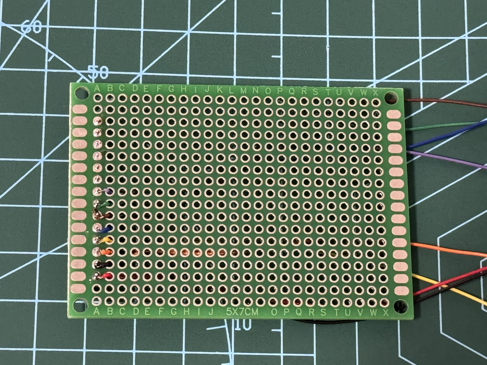 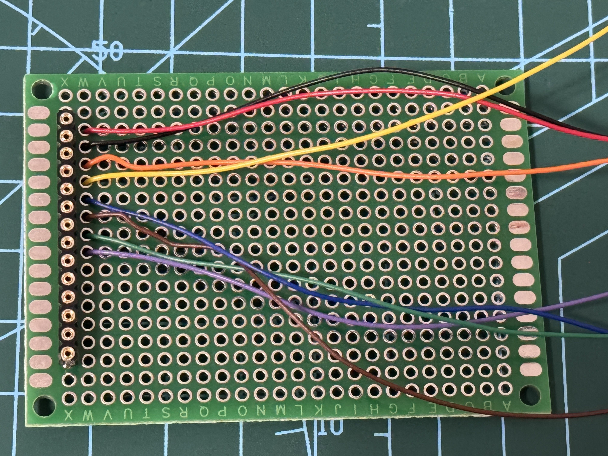

4. **Solder Remaining Headers**

   - Connect all other headers and wires.
   - Keep wires slightly longer in case adjustments are needed.  
     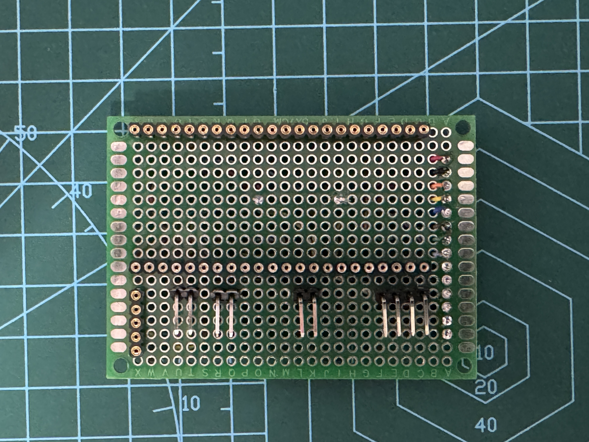 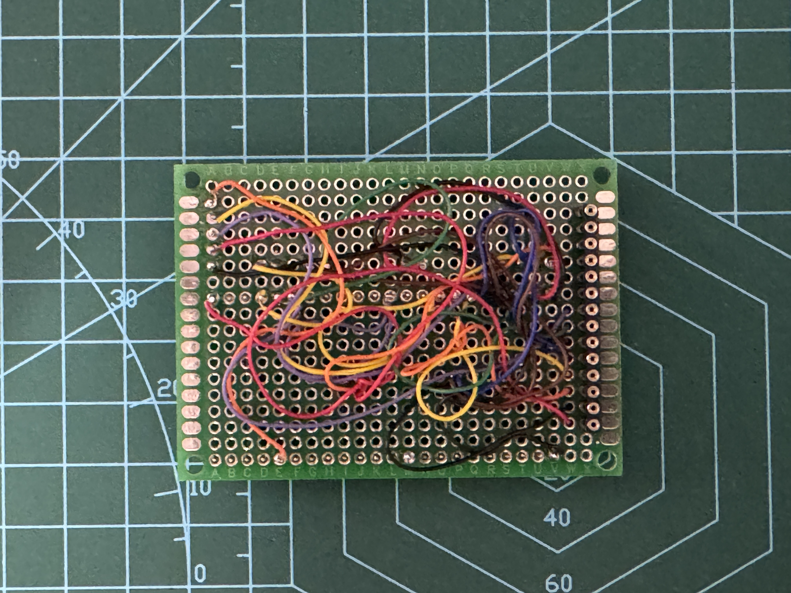

5. **Fit Components**

   - Ensure the modules fit inside the case.
   - Sand the sides of the RTC if space is tight.  
     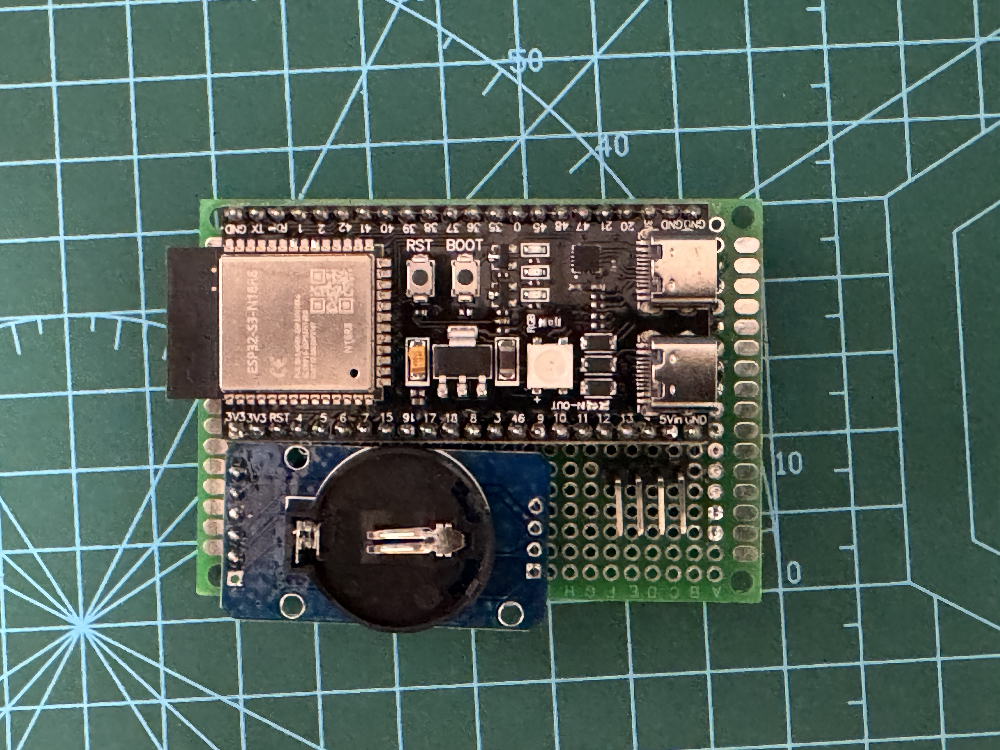

6. **Install Heat-Set Inserts**

   - Insert into the back panel of the case for M2 screws (sizes: 3×3.2mm and 2×4mm).  
     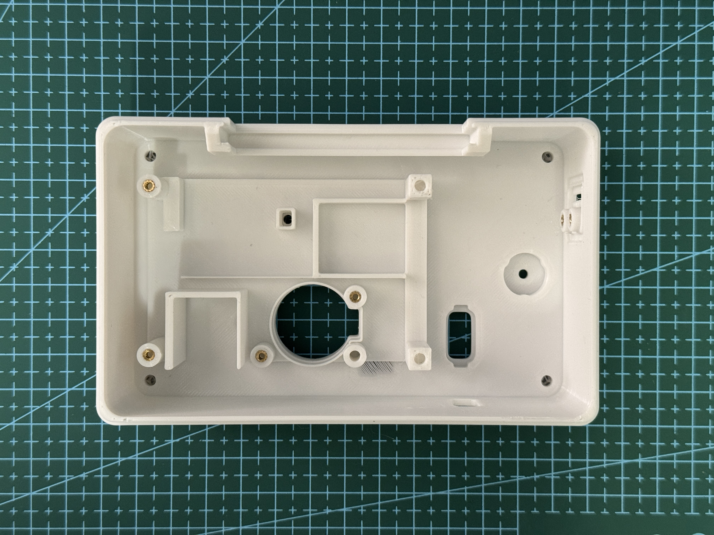 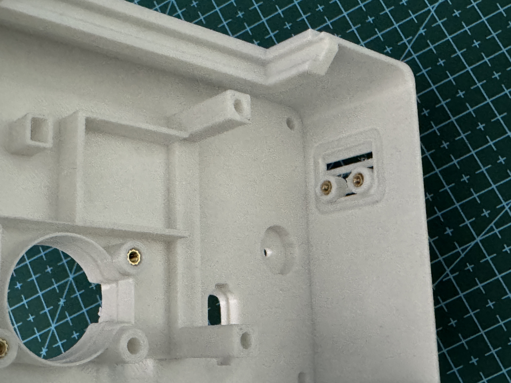 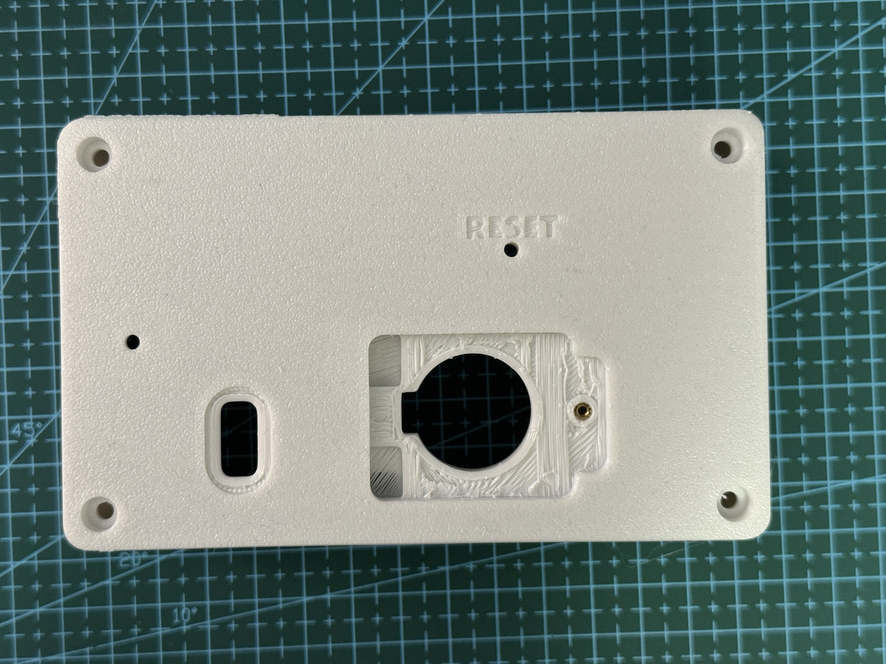

7. **Install Front Panel Inserts**

   - Install inserts for the display (M2) and posts (M3).

8. **Assemble Components**

   - Plug in all connectors.
   - Secure the display, RTC, and sensors with the appropriate screws.  
     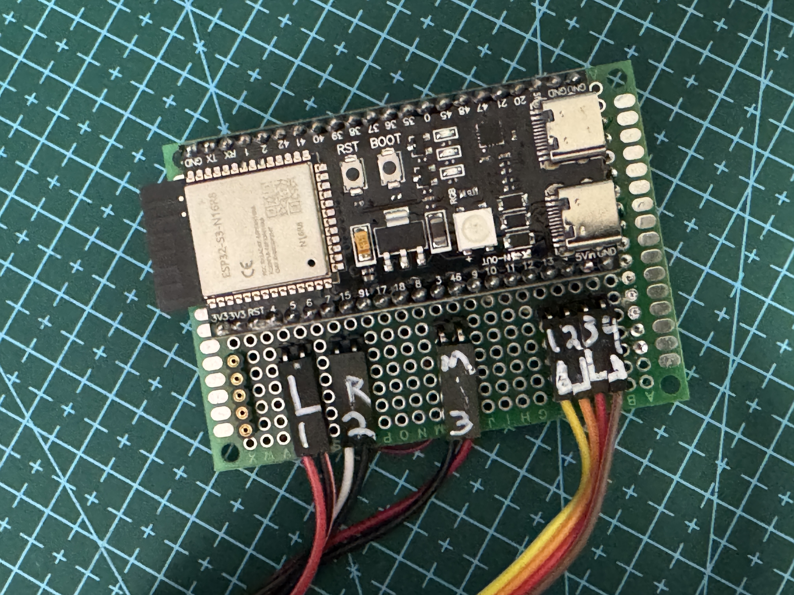 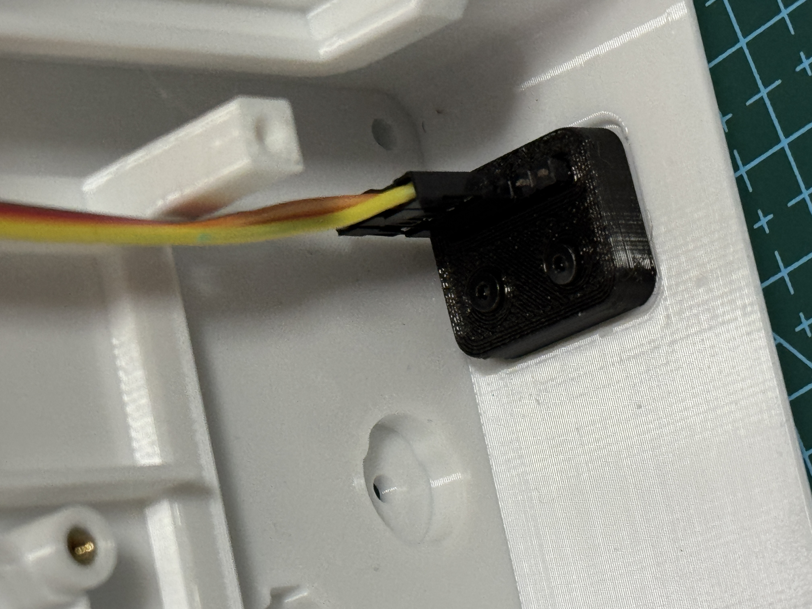 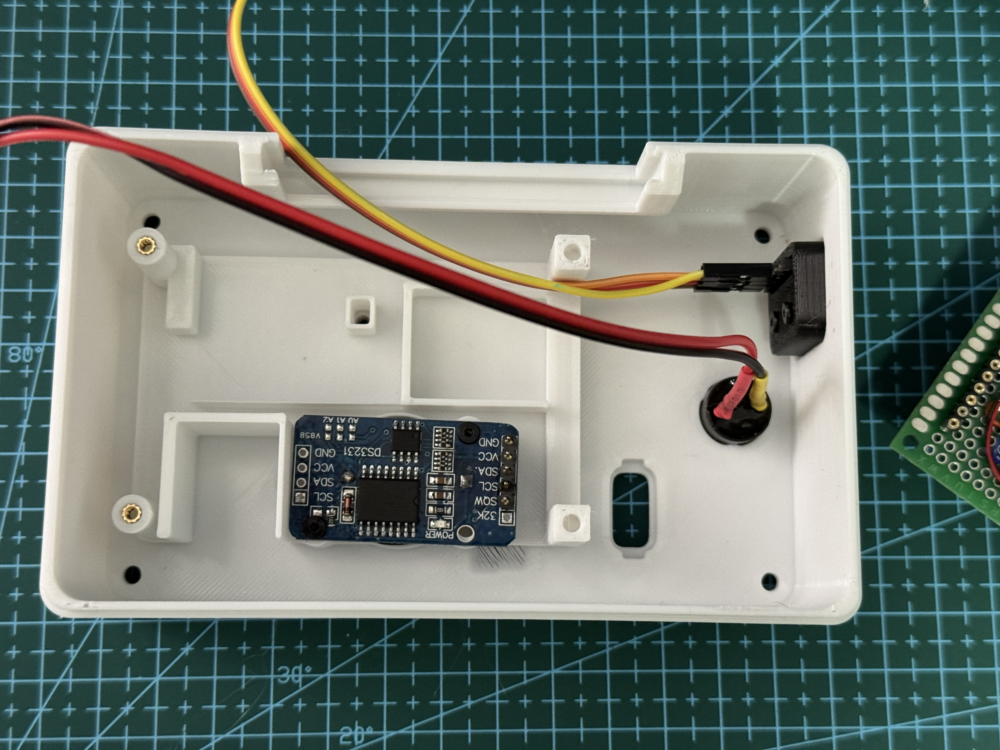 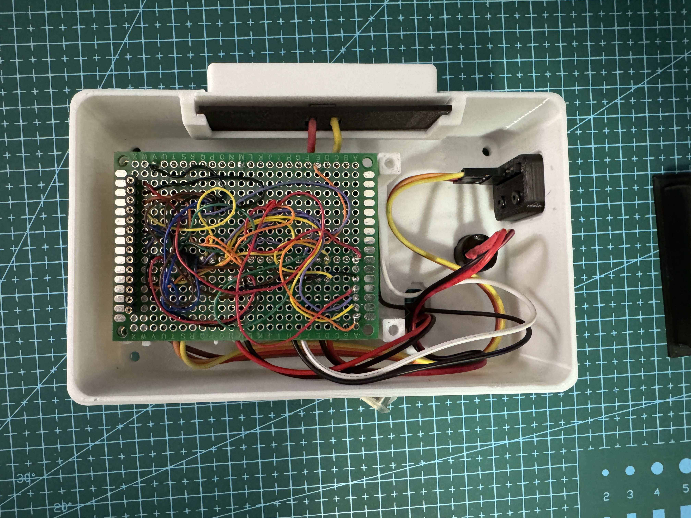

9. **Close Case and Power On**
   - Screw the case together and connect power.  
     

## Wiring

The components are connected using the I2C and SPI buses.

| Component                 | Pin       | ESP32-S3 GPIO | Notes                 |
| ------------------------- | --------- | ------------- | --------------------- |
| **4" ILI9488 IPS (SPI)**  | VCC       | 3.3V          | Connect to 3.3V pin   |
|                           | GND       | GND           | Common ground         |
|                           | CS        | GPIO 10       | Chip Select           |
|                           | RST       | GPIO 11       | Reset                 |
|                           | DC        | GPIO 12       | Data/Command          |
|                           | MOSI      | GPIO 13       | Data In               |
|                           | SCK       | GPIO 14       | Clock                 |
|                           | LED       | GPIO 6        | Backlight (PWM)       |
|                           | MISO      | UNUSED        | Data Out              |
| **DS3231 & BME280 (I2C)** | VCC       | 3.3V          | Shared 3.3V           |
|                           | GND       | GND           | Shared ground         |
|                           | SDA       | GPIO 8        | Shared data line      |
|                           | SCL       | GPIO 9        | Shared clock line     |
| DS3231                    | SQW       | GPIO 2        | Interrupt for alarms  |
| **Active Buzzer**         | +         | GPIO 4        | Any free GPIO         |
|                           | -         | GND           | Common ground         |
| **Stop/Snooze Button**    | One leg   | GPIO 5        | Use INPUT_PULLUP mode |
|                           | Other leg | GND           | Common ground         |

## Software Setup

This project is developed using **PlatformIO**.

### Libraries

The following libraries are required and are automatically managed by PlatformIO via the `platformio.ini` file:

- `bodmer/TFT_eSPI`
- `bblanchon/ArduinoJson`
- `adafruit/RTClib`
- `adafruit/Adafruit BME280 Library`
- `esphome/ESPAsyncWebServer-esphome`
- `esphome/AsyncTCP-esphom`

### Build Instructions

1.  **Clone the Repository**:
    ```bash
    git clone https://github.com/KennethDoerflein/ESP32Clock.git
    cd ESP32Clock
    ```
2.  **Open in PlatformIO**: Open the project folder in VS Code with the PlatformIO extension installed.
3.  **Build & Upload**: Use the PlatformIO "Build" and "Upload" commands to compile and flash the firmware to your ESP32-S3.

---

## Software Architecture

The firmware is organized into a collection of singleton manager classes and modular components running across the ESP32-S3's dual cores (Core 0 for network/logic/logging; Core 1 for display rendering and timekeeping):

- **`AlarmManager`**: Manages physical alarm ringing, buzzer frequency ramping across 3 progressive stages (slow beep -> fast beep -> continuous), display backlight flashing, reboot resume, and auto-shutoff timer.
- **`ButtonManager`**: Provides debounced interrupt-based input handling for the multi-function physical button (press durations, page switching, snooze, and hold-to-dismiss).
- **`ClockWebServer`**: Asynchronous web server hosting the configuration UI, REST API endpoints, live log WebSocket server, captive portal, and firmware upload receiver.
- **`ConfigManager`**: Thread-safe configuration manager utilizing ESP32 NVS Preferences for persistent storage with write debouncing to protect flash memory.
- **`DisplayManager`**: Orchestrates active display page lifecycle, page transitions, alarm overlay banners, dismiss progress bars, and status icons with display preemption on Core 1 for zero jitter.
- **`Display`**: Low-level TFT display abstraction (ILI9488 SPI driver), screen rotation, color inversion, and LEDC PWM backlight control.
- **`FirmwareVerifier`**: Provides cryptographic verification using Ed25519 signatures and SHA-256 streaming hashing before applying firmware updates.
- **`NtpSync`**: Multi-tiered NTP client featuring exponential backoff, jitter, and automatic fallback across NIST, Cloudflare, and NTP Pool servers.
- **`SensorModule`**: Interfaces with the BME280 (I2C) and DS3231 sensors, implementing I2C bus recovery, exponential moving average (EMA) noise filtering, enclosure thermal compensation, and August-Roche-Magnus humidity correction.
- **`SerialLog`**: Centralized thread-safe logger mirroring serial output to a live WebSocket feed, persistent rotating LittleFS file (`system.log`), and RTC memory crash dump buffer.
- **`TimeManager`**: High-accuracy timekeeping coordinator bridging the DS3231 hardware RTC and ESP32 system clock, tracking Daylight Saving Time, drift compensation, missed alarm detection, and biweekly parity calculations.
- **`UpdateManager`**: Handles OTA firmware updates via file upload and automated GitHub Releases checks with cryptographic signature verification and dual-OTA partition rollback safety.
- **`WeatherService`**: Handles asynchronous geocoding and fetches comprehensive weather metrics from Open-Meteo via HTTPS with PSRAM-backed JSON filtering; network loops execute in the background Logic Task (Core 0) with HTTPS requests offloaded to a persistent FreeRTOS worker (`WeatherUpdate` on Core 1 at priority 1, preempted by Core 1 display rendering).
- **`WiFiManager`**: Manages WiFi STA connection, automatic reconnection, non-blocking connection tests, DNS captive portal, network scanning, and mDNS responder.
- **`Page`**: An abstract base class for display pages:
  - **`ClockPage`**: Large retro-styled digital clock face with time, AM/PM, seconds, day of week, date, indoor temperature, indoor humidity, and next alarm indicators.
  - **`WeatherPage`**: Dedicated weather display showing current outdoor temperature, condition description, humidity, wind, and rain chance.
  - **`WeatherClockPage`**: Split-layout screen combining clock display with live outdoor conditions and indoor environmental data.
  - **`InfoPage`**: Static information screen showing device hostname, IP address, and firmware version.

---

## Usage Guide

### First-Time Setup

1.  On the first boot, or if WiFi credentials are not configured/valid, the clock will start a Wi-Fi Access Point (AP). The SSID will be **`Clock-Setup`**.
2.  Connect to this network from your phone or computer.
3.  Open a web browser and navigate to the clock's static IP address, which is **`http://192.168.4.1`**. This address is fixed when the clock is in AP mode.

### Web Interface

The web interface provides access to all the clock's settings. Once connected to your WiFi network, you can access the web interface by navigating to the IP address shown on the clock's display or by using its mDNS address (e.g., `http://ESP32Clock-XXXXXX.local`).

The web interface is organized into several sections:

- **Configure WiFi**: For connecting to your local network and setting a hostname.
- **Alarms**: For setting and managing up to 20 alarms.
- **Weather**: For configuring the location and viewing weather status.
- **Settings**: For adjusting display, time, brightness, and page configuration.
- **Logs**: For viewing live logs and managing log files.
- **System**: For system-level actions like updates, reboots, and viewing system information.

### Physical Button Functions

The physical button (connected to GPIO 5) is debounced via interrupts and serves multiple functions depending on the system state:

- **Normal Operation (Idle)**:
  - A **short press** cycles through the configured enabled display pages in sequence (e.g., Clock -> Weather -> Info -> Weather+Clock).
- **Alarm Ringing**:
  - A **short press** will **snooze** the ringing alarm for the configured snooze duration (default 9 minutes).
  - **Pressing and holding** the button will **dismiss** the alarm. A graphical progress bar fills at the bottom of the screen while held; once the configured dismiss duration (default 3 seconds) is reached, the alarm is dismissed.
- **Alarm Snoozed**:
  - **Pressing and holding** the button for the dismiss duration will cancel snooze for all snoozed alarms, with real-time visual progress feedback on the display.

### Safe Mode & Boot Loop Protection

The firmware includes multi-stage boot protection to prevent bricking if an error or crash occurs during startup:

- **Boot Counter**: A persistent counter in NVS is incremented immediately upon boot. It is only reset to zero after 30 seconds of stable, uninterrupted uptime.
- **Automatic Firmware Rollback**: If repeated crashes occur and a previous working firmware partition is available in dual-OTA layout (`app0` / `app1`), the device automatically rolls back to the prior firmware version.
- **Safe Mode Environment**: If 10 consecutive crash-boots occur without rollback, the clock halts normal initialization and enters **Safe Mode**:
  - Starts minimal recovery peripherals only (screen, WiFi, and a lightweight web recovery server).
  - Attempts to connect to saved WiFi or launches fallback AP **`Clock-SafeMode`** (`http://192.168.4.1`).
  - Displays recovery instructions and IP on the screen.
  - Allows uploading a fixed firmware binary via browser to recover the device without physical disassembly or serial flashing.

### Factory Reset

There are three ways to perform a factory reset:

1.  **Via the Web Interface**: Navigate to the "System" page and click either:
    - **Factory Reset**: Erases all stored settings (including WiFi credentials, alarms, and display preferences) and reboots the device into setup mode. System and crash logs persist across factory resets.
    - **Factory Reset (Keep WiFi)**: Erases all alarms, colors, and display settings, but preserves saved WiFi credentials. System and crash logs persist across factory resets.
2.  **Boot-Time Reset (Physical)**:
    - Disconnect the clock from power.
    - Press and hold the **Snooze button** (GPIO 5).
    - Reconnect power while continuing to hold the button.
    - Hold for **10 seconds**. The screen will display `"Hold for factory reset"` and then trigger the reset.
3.  **Runtime Reset (Physical)**:
    - While the clock is running normally, press and hold the **Boot button** (GPIO 0) on the ESP32 board for **10 seconds**.

---

## Features and Settings in Detail

### WiFi Page

This page allows you to connect the clock to your local WiFi network.

- **Scan for Networks**: Click the "Scan" button to see a list of available 2.4 GHz WiFi networks with signal strength. Clicking on a network name automatically populates the SSID field.
- **SSID & Password**: Manually enter or adjust your network's credentials.
- **Test Connection**: Test credentials non-blockingly without saving or rebooting to confirm valid authentication.
- **Save & Reboot**: Save credentials to persistent NVS storage and automatically reboot into station mode.
- **Hostname**: Set a custom network hostname (1–63 alphanumeric characters or hyphens). This configures the DHCP client name and the mDNS local domain (e.g., `http://your-hostname.local`).

### Alarms Page

- **Dynamic Alarms**: Add and configure up to 20 alarms simultaneously. Click "Add Alarm" to create a new one.
- **Alarm Configuration**:
  - **Enable/Disable**: Toggle any alarm on or off individually.
  - **Time**: Select hour and minute in 12-hour or 24-hour format.
  - **Repeat Days**: Choose specific days of the week (Sunday through Saturday), or leave days unselected for a one-time alarm that auto-disables after ringing.
  - **Biweekly Mode**: Enable alternating two-week alarm schedules (even vs. odd ISO week parity cycles), ideal for shift work or rotating schedules.
  - **Delete**: Permanently remove alarms.
- **Progressive Ramping Buzzer**:
  - **Stage 1 (0–10s)**: Gentle slow beeps (200ms on, 800ms off).
  - **Stage 2 (10–30s)**: Urgent fast beeps (150ms on, 150ms off).
  - **Stage 3 (30s–30m)**: Continuous high tone.
  - **Auto-Shutoff**: Silences automatically after 30 minutes to prevent unattended ringing.
- **Visual Feedback**:
  - Flashing screen backlight while ringing.
  - Large on-screen ringing banner displaying "ALARM" (or remaining countdown MM:SS when snoozed).
  - When snoozed, an icon and countdown show the remaining snooze time.
  - Animated dismiss progress bar at the bottom of the screen during button holds.
- **Snooze & Dismiss Controls**:
  - **Snooze Duration**: Configurable snooze time in minutes (default 9 minutes).
  - **Dismiss Hold Duration**: Configurable hold time in seconds required to dismiss an active alarm or cancel snooze (default 3 seconds).
- **Power Failure & Clock Jump Resiliency**:
  - **Ringing State Persistence**: If power is cut while an alarm is ringing, the clock detects the active state upon boot, resumes ringing with the appropriate elapsed stage offset, and flashes the display.
  - **Missed Alarm Window Catch-Up**: Checks for alarms that should have fired during unexpected power outages, reboots, or manual/NTP clock jumps and triggers them immediately (capped at 90 minutes).

### Weather Page

This page allows you to configure location and inspect comprehensive weather metrics.

- **Location Input**: Enter a city or address (e.g., "Seattle, WA", "Berlin, Germany", or zip code) and click "Save Location".
- **Asynchronous Geocoding**: Resolves addresses in the background without blocking web requests or clock rendering, supporting international locations and US state abbreviations.
- **Automatic Coordinates**: Stores resolved latitude and longitude in NVS; clearing the field disables weather polling.
- **Comprehensive Live Metrics**:
  - Current Temperature and Apparent ("Feels Like") Temperature.
  - Relative Humidity (%) and Precipitation Chance (%).
  - Wind Speed, Wind Direction (compass bearing, e.g., "NW"), and Wind Gusts.
  - Atmospheric Pressure (hPa) and Visibility (meters).
  - Cloud Cover (%) and UV Index.
  - WMO Condition Description (e.g., "Clear", "Partly Cloudy", "Rain Showers", "Thunderstorm").
  - Sunrise and Sunset times (formatted according to 12h/24h preference).
- **Force Sync**: Trigger an immediate weather data refresh on demand.
- **Background FreeRTOS Worker**: Dedicated persistent task on Core 1 with 10-minute update interval, exponential failure backoff, and PSRAM JSON parsing to avoid heap fragmentation.

### Settings Page

Divided into "General" and "Display" tabs.

#### General Tab

- **Page Configuration**:
  - **Default Page**: Choose which page the clock defaults to on startup (Clock, Weather, Info, or Weather+Clock).
  - **Enabled Pages**: Reorder pages via Move Up / Move Down buttons or uncheck to remove them from physical button cycling.
- **Offline Mode**: Completely turns off WiFi and all network operations (NTP, weather). Timekeeping and sensor monitoring continue uninterrupted.
- **Brightness Settings**:
  - **Auto Brightness**: Schedule-based backlight dimming. Configure daytime start hour, night start hour, daytime brightness level (0–255), and night brightness level (0–255).
  - **Manual Brightness**: Fixed brightness slider active when Auto Brightness is disabled.
- **Time and Display Format**:
  - **24-Hour Format**: Toggle between 12-hour (with AM/PM) and 24-hour formats.
  - **Temperature Units**: Toggle globally between Celsius (°C) and Fahrenheit (°F).
  - **Flip Display Orientation**: Rotates the display 180 degrees.
  - **Invert Colors**: Hardware IPS color inversion toggle.
- **Timezone**: Select from standard POSIX timezone definitions with automated Daylight Saving Time transitions.
- **Temperature Sensors & Calibration**:
  - **Auto Temperature Calibration**: Performs automatic cold-boot calibration of the ambient sensor.
  - **Manual Temperature Correction**: Set a fixed temperature offset (±°C) to adjust readings.
  - **Temperature Compensation Factor**: Adjusts the ratio (0.00 to 1.00) of internal RTC temperature used to dynamically subtract enclosure heat from the ambient sensor.
  - **August-Roche-Magnus Humidity Correction**: Automatically recalculates accurate relative humidity from the dew point whenever temperature offsets are applied.
- **Reset General Settings**: Reverts general configuration options to factory defaults.

#### Display Tab

Customizes the color palette of every element rendered on the screen:

- **Color Pickers**: 10 distinct hex color pickers in the web UI for Background, Time, AM/PM Indicator (TOD), Seconds, Day of Week, Date, Indoor Temperature, Indoor Humidity, Weather Temperature, and Forecast Condition text (with system defaults for alarm and snooze icons).
- **Reset to Defaults**: Restores all display colors to their default retro-cyan/green palette.

### Logs Page

Diagnostic tools for live monitoring and crash analysis:

- **Live Log Viewer**: Real-time streaming console output delivered via WebSockets with automatic reconnection and client cleanup.
- **System Log File (`system.log`)**:
  - Persistent log stored in LittleFS with automatic rotation at 256 KB (`system.log.old`).
  - Web download button and manual "Rotate Log" trigger.
  - Thread-safe write buffering to prevent filesystem corruption.
- **Crash Log File (`crash.log`)**:
  - Diagnostic crash log recording boot reset reasons, panic backtraces, and pre-crash log buffer contents captured in non-volatile RTC memory across watchdog resets and brownouts.
  - Download and clear crash log endpoints.
- **ESP32 Core Dump (`coredump.bin`)**:
  - Downloads raw ELF/binary core dumps saved to the dedicated `coredump` partition (`0xE10000`) for post-mortem GDB debugging.
  - Web button to clear/erase core dump flash partition.

### System Page

System diagnostics, updates, and maintenance:

- **Cryptographic Firmware Update**:
  - **Manual Upload**: Upload a compiled `firmware.bin` directly from your browser.
  - **GitHub Update**: Queries GitHub Releases API for the latest release tag. Downloads `firmware.bin`, `firmware.sig`, and `firmware.sha256`, verifying the Ed25519 cryptographic signature against the onboard public key before flashing.
  - **Dual-OTA Partitions & Rollback**: Uses `app0` / `app1` partitions. If newly flashed firmware fails to run stably for 30 seconds, the device automatically cancels the update and rolls back to the previous operational firmware.
- **System Actions**:
  - **Reboot Device**: Cleanly flushes settings and performs a software restart.
  - **Factory Reset**: Erases all configuration in NVS flash and restarts.
  - **Factory Reset (Keep WiFi)**: Clears alarms, display settings, and preferences while preserving WiFi credentials.
  - **NTP Time Sync**: Manually triggers an immediate NTP synchronization cycle.
  - **Manual Browser Time Sync**: One-click button (`/api/system/time`) that writes the client browser's exact Unix epoch to the DS3231 hardware RTC and system clock, calculating drift diagnostics and catching missed alarms.
- **Live System Statistics**:
  - **Free Heap**: Real-time available heap memory and minimum lifetime heap.
  - **Uptime**: Continuous device run time since last boot.
  - **WiFi RSSI**: Signal strength in dBm.
  - **ESP32 Core Temperature**: Internal silicon temperature measured by on-chip thermal sensor.
  - **Sensor Status**: Detection indicators and raw readings for BME280, DS3231 RTC, and enclosure compensation offsets.

### Temperature & Environmental Sensor Architecture

1.  **BME280 Environmental Sensor**: Connected via shared I2C bus (GPIO 8/9). Measures ambient temperature, relative humidity, and barometric pressure. Features 9-clock I2C bus recovery on startup, exponential moving average (EMA) noise smoothing, and thermal inertia modeling.
2.  **DS3231 High-Precision RTC**: Battery-backed I2C timekeeper with an internal temperature-compensated crystal oscillator (TCXO). Its internal temperature reading is used as an enclosure reference to subtract circuit heat from the ambient sensor.
3.  **ESP32-S3 Internal Sensor**: Built-in silicon temperature sensor monitored for system health diagnostics and CPU load tracking.
4.  **Brightness-Scaled Thermal Compensation**: Blends internal core and RTC temperatures (`0.25 * core + 0.75 * RTC`) to model enclosure heating, dynamically scaled by backlight PWM duty cycle (`0.80 + 0.20 * brightness_ratio`) and smoothed by an exponential moving average (EMA, alpha=0.02) to track enclosure thermal inertia without sudden jumps.